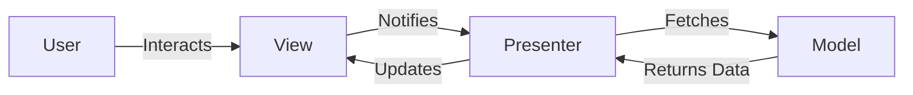
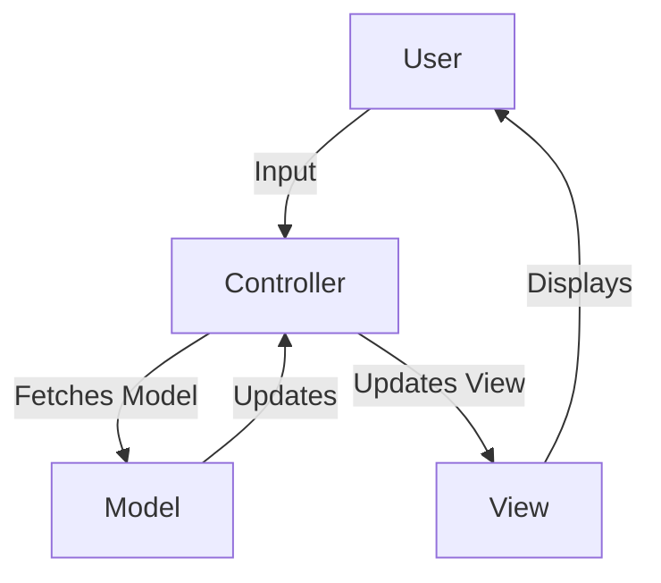
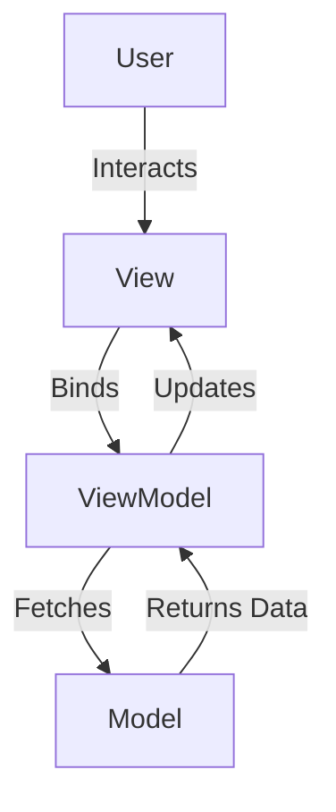
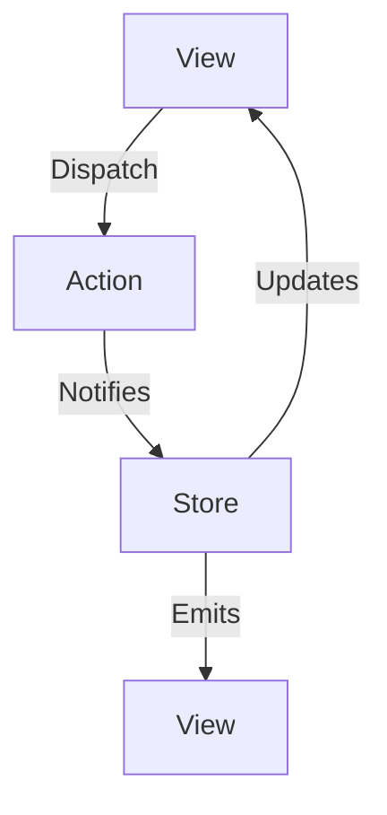
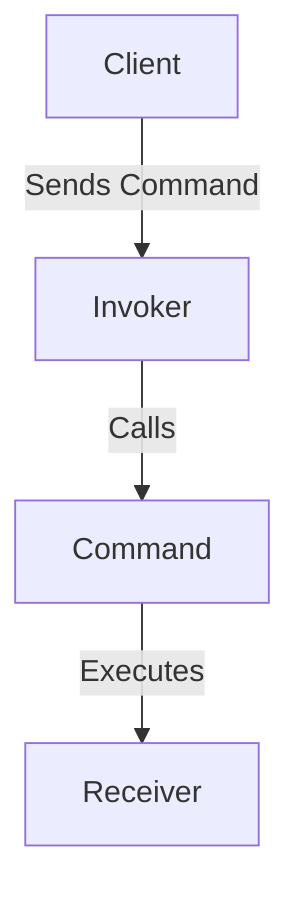
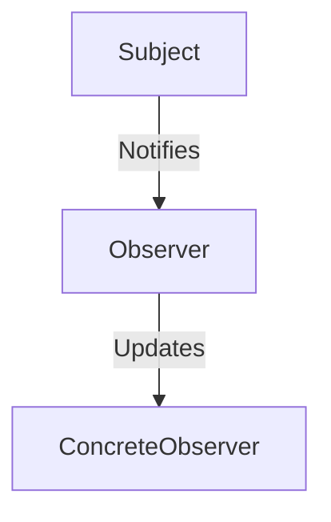

# MCP Design Patterns Diagrams

## 1. Model-View-Presenter (MVP)

## 2. Model-View-Controller (MVC)

## 3. Model-View-ViewModel (MVVM)

## 4. Flux

## 5. Command Pattern

## 6. Observer Pattern

