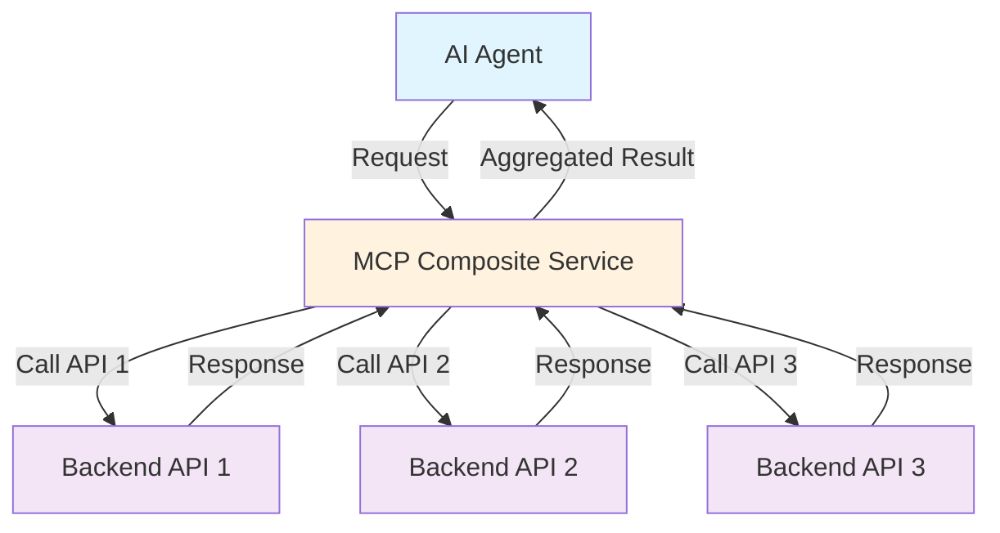
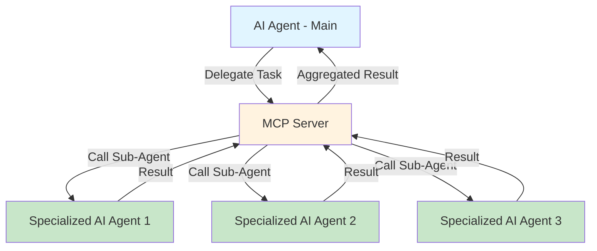
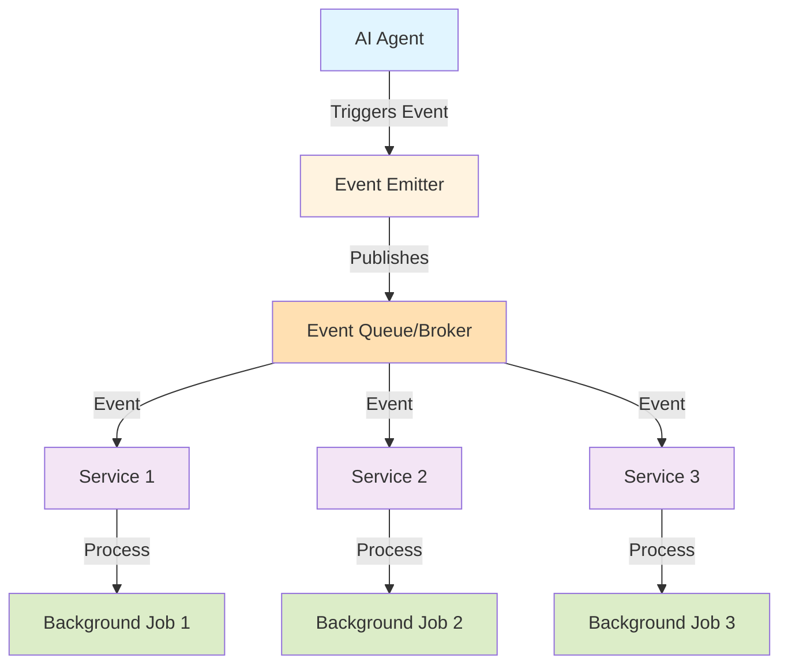
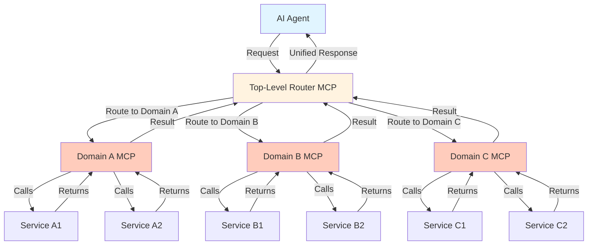
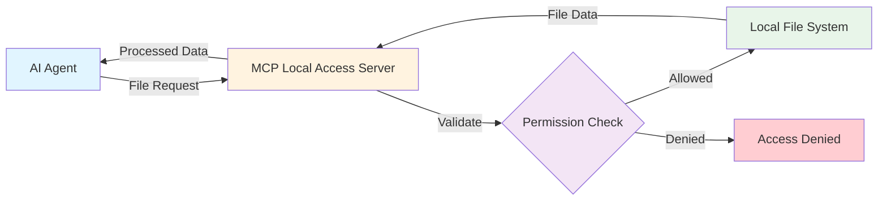

# MCP Design Patterns - Visual Diagrams

## 1. Direct API Wrapper Pattern

**Description:** Simple 1:1 mapping between MCP tools and existing APIs.

---

## 2. Composite Service Pattern

**Description:** Combines and orchestrates multiple APIs into a single, higher-level service.

---

## 3. MCP-to-Agent Pattern

**Description:** MCP tools call other AI agents for specialized reasoning or domain expertise.

---

## 4. Event-Driven Integration Pattern

**Description:** MCP tools emit events to trigger asynchronous or background processing.

---

## 5. Hierarchical MCP Pattern

**Description:** Organizes MCP servers in layered domains with top-level routers handling coordination.

---

## 6. Local Resource Access Pattern

**Description:** Gives secure access to local file systems for fast document or data processing.

---

## Pattern Comparison Matrix

| Pattern | Complexity | Scalability | Best For | Key Advantage |
|---------|-----------|-------------|----------|---------------|
| Direct API Wrapper | Low | Medium | Simple APIs | Speed & simplicity |
| Composite Service | Medium | Medium | Multi-API workflows | Orchestration |
| MCP-to-Agent | High | High | Complex reasoning | Modularity & expertise |
| Event-Driven | High | Very High | Real-time systems | Scalability & decoupling |
| Hierarchical | Very High | Very High | Enterprise systems | Manageability at scale |
| Local Resource | Low | Medium | High-performance tasks | Performance & security |

---

## When to Use Each Pattern

### Direct API Wrapper
- ✅ Third-party APIs are stable and well-documented
- ✅ Minimal engineering overhead needed
- ❌ Not suitable for complex multi-step workflows

### Composite Service
- ✅ Need to orchestrate multiple services
- ✅ Want to abstract complexity from the agent
- ❌ Avoid if APIs are frequently changing

### MCP-to-Agent
- ✅ Multiple AI agents with specialized roles
- ✅ Complex reasoning requiring domain expertise
- ❌ Can increase latency with too many hops

### Event-Driven
- ✅ Real-time, high-throughput systems
- ✅ Asynchronous processing required
- ❌ Needs careful event schema management

### Hierarchical
- ✅ Large enterprise deployments
- ✅ Multiple business domains
- ❌ More complex to maintain and monitor

### Local Resource Access
- ✅ High-performance file processing needed
- ✅ Offline or secure environments
- ❌ Limited to local resources only